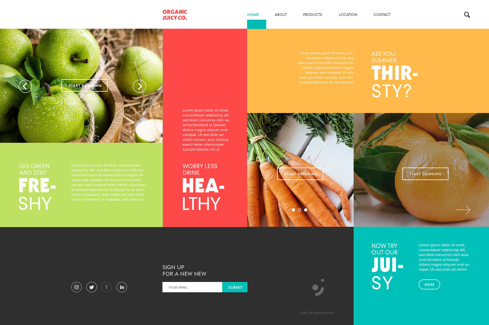

# ORGANIC JUICY COMPANY WEBSITE

## Live Demo
Check out the live website: [ORGANIC JUICY COMPANY WEBSITE](https://organic-juicy-com.netlify.app/)

## Description
Welcome to the ORGANIC JUICY COMPANY website! This website is built using the grid display model, along with CSS styles and JavaScript functions. It's designed to be adaptable to different screen sizes and resolutions, allowing for seamless viewing on various devices. Whether you're accessing it from a desktop, tablet, or smartphone, the website's layout and elements adjust accordingly.

Key features of this website include:

- **Grid Display**: Utilizing the grid layout model for responsive and organized content placement.
- **CSS Styles**: Styling elements to create an attractive and user-friendly interface.
- **JavaScript Functions**: Enhancing interactivity and functionality with JavaScript.
- **Mobile Compatibility**: Providing a burger menu for easy navigation on mobile devices.

Feel free to explore the website and customize it further by adding new elements or removing existing ones to suit your needs!

## Instructions
To explore the code or make modifications, follow these steps:

1. **Download**: Download the code from the branch.
2. **Open**: Open the downloaded code in any code editor.
3. **Start**: Open index.html in a browser or use a plugin in your code editor to launch the project live.

This will start the project and you can view it in your browser.

## License
Distributed under the MIT License. See LICENSE.txt for more information.

Author of layout: https://www.behance.net/gallery/55548359/Organic-Juicy-Co-Logo-Design-and-Branding
